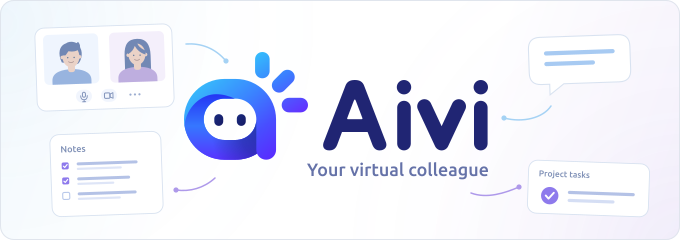

# aivi

<p align="center">
  <picture>
    <source media="(prefers-color-scheme: dark)" srcset=".github/assets/aivi-banner-dark.svg">
    <source media="(prefers-color-scheme: light)" srcset=".github/assets/aivi-banner-light.svg">
    
  </picture>
</p>

An always-on teammate built around OpenCode v2. OpenCode stays the runtime for
agents, sessions, providers, tools, skills, and permissions. aivi adds what a
team needs around it: a shared knowledge server, scheduled work, and channels
such as Discord and Slack, all started by one **`aivi serve`**. Ordinary OpenCode
installs reach the knowledge server through a small native plugin.

> [!WARNING]
> This project is under active development and it will be at least until OpenCode v2 is released. Don't use it. Or do, and suffer lol. Also this project is being used to build itself using exclusively local models because I am insane.

## Quick start

Install the CLI, then create a server here or sign this machine in to an
existing one. `aivi setup` asks which, installs the OpenCode plugins, and
ends with a verified "Signed in as …" — never a promise it can't keep.
Requires Node 26.

```sh
npm i -g @aivi/cli
aivi setup
```

Then run the server in the foreground, or install it as a background service
with `aivi service install`:

```sh
aivi serve
```

From here on: [getting started](docs/getting-started.md) (searching, the
librarian in OpenCode, a project, a chat channel).

## Development

Working on aivi itself? From the repository root:

```sh
npm ci
npm run check
npm run aivi -- serve
```

`npm run aivi` uses `example/`, a complete home with everything enabled; it
builds first (incremental, TypeScript 7) and runs the compiled `dist/` — the
same artifact npm publishes, so local and installed behavior are identical.

## Packages

| Package                 | Responsibility                                                                                                                                                                                     |
| ----------------------- | -------------------------------------------------------------------------------------------------------------------------------------------------------------------------------------------------- |
| `@aivi/cli`             | The thin CLI: one `setup` signs a machine in or creates the server (identity minting stays in the installed app), forwards every command to it, runs it in the background (`service`), updates it (`update`/`upgrade`)                            |
| `@aivi/app`             | `aivi` CLI; composes configured modules and launches the host                                                                                                                                      |
| `@aivi/core`            | Config and access-policy schemas, knowledge kinds, contracts, logger                                                                                                                               |
| `@aivi/host`            | Lifecycle, API, scheduler, SQLite store, capacity leases, OpenCode connection, session driver, dreaming, the channel module contract with the shared inbox, engine and turn runner, report routing |
| `@aivi/knowledge`       | QMD-backed document indexing and scoped keyword search                                                                                                                                             |
| `@aivi/browser`         | Chrome DevTools MCP, persistent profile, session-owned tabs                                                                                                                                        |
| `@aivi/channel-discord` | Discord channel module: gateway, DM/thread routing, sending, slash commands, report threads                                                                                                        |
| `@aivi/channel-slack`   | Slack channel module: Socket Mode, DM/thread routing, sending, manifest slash commands, report threads                                                                                             |
| `@aivi/linear`          | Linear module: one app receiving every webhook, the assistant for people, workers in git worktrees, the Linear MCP proxy ([linear](docs/linear.md))                                                |
| `@aivi/opencode`        | OpenCode plugin: `knowledge_search`, `knowledge_projects`, `aivi_sources`, `aivi_status`, `aivi_context`, `aivi_jobs`, `aivi_browser`                                                              |

Modules and jobs call shared services in-process. The plugin reaches the same
services over the authenticated host API. Linear is an in-process module with
a webhook route per app on the same listener (`/v1/linear/webhooks/app/<id>`).

## Status

- Live-verified against OpenCode 2.0.3 and a Discord test server on the target
  Mac: discovery and auth, plugin tools, the session driver (jobs, dreaming,
  Discord turns all end in a verified final answer), Discord DMs/channels/
  threads with slash commands and job reports.
- Browser control: live-verified against headless Chrome on the target Mac
  (`npm run smoke:browser`); login takeover and extensions still to exercise.
- Knowledge: core and per-project sources with kinds (`doc`, `decision`,
  `memory`, `conversation`); scope never widens on unknown IDs. Projects are
  clean checkouts under `<home>/projects/`, described from the home by a
  `docs/` convention ([docs/projects.md](docs/projects.md)).
- Jobs: definitions (cron or one-off `at`) and their runs in SQLite, Croner
  as the calendar, `shell` and `prompt` tasks plus claimed system operations
  (`invocation`), dedupe, pools and leases, restart recovery, missed-run accounting,
  retention, reports.
- Dreaming: a scheduled agent maintains `facts.md` and proposals from
  conversations since its last run ([docs/dreaming.md](docs/dreaming.md)).

Next, in order: next channels, installation on other machines, the Linear
live gate. Details and milestone status: [docs/roadmap.md](docs/roadmap.md);
unscheduled ideas: `docs/backlog/`.

`npm run agentic:verify` runs Biome and `npm run check` (build, tests against
real SQLite, real QMD and the real v2 client on a mock server, schema check,
CLI and daemon smoke). Live gates: `npm run live:opencode`, `npm run smoke:browser`.

## Releases

Versions are independent per package, managed with
[Changesets](.changeset/README.md): run `npx changeset` in a PR that changes a
package, describe the change and the bump level. Merging to `main` opens a
Version PR; merging that publishes the changed packages to npm with
provenance — no tags, no manual publishing.

New here? [Getting started](docs/getting-started.md) to run it,
[operations](docs/operations.md) to keep it running,
[configuration](docs/configuration.md) for every field. Working on it? Start
with [CONTEXT.md](CONTEXT.md), then [architecture decisions](docs/architecture.md),
[OpenCode integration](docs/opencode.md), [channel modules](docs/channels.md),
[projects](docs/projects.md), [knowledge search](docs/knowledge.md),
[dreaming](docs/dreaming.md), [Discord](docs/discord.md), [Slack](docs/slack.md),
[browser](docs/browser.md), and [roadmap](docs/roadmap.md).
