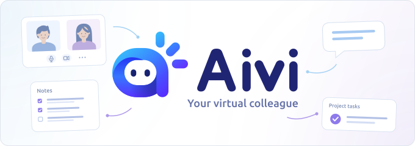

# aivi

<p align="center">
  <picture>
    <source media="(prefers-color-scheme: dark)" srcset=".github/assets/aivi-banner-dark.svg">
    <source media="(prefers-color-scheme: light)" srcset=".github/assets/aivi-banner-light.svg">
    
  </picture>
</p>

An always-on teammate built around OpenCode v2. OpenCode stays the runtime for
agents, sessions, providers, tools, skills, and permissions. aivi adds what a
team needs around it: a shared knowledge server, scheduled work, and channels
such as Discord and Slack, all started by one **`aivi serve`**. Ordinary OpenCode
installs reach the knowledge server through a small native plugin.

> [!WARNING]
> This project is under active development and it will be at least until OpenCode v2 is released. Don't use it. Or do, and suffer lol. Also this project is being used to build itself using exclusively local models because I am insane.

## Quick start

Install the CLI, then create a server here or sign this machine in to an
existing one. `aivi setup` asks which, installs the OpenCode plugins, and
ends with a verified "Signed in as …" — never a promise it can't keep.
Requires Node 26.

```sh
npm i -g @aivi/cli
aivi setup
```

Then run the server in the foreground, or install it as a background service
with `aivi service install`:

```sh
aivi serve
```

From here on: [getting started](docs/getting-started.md) (searching, the
assistant in OpenCode, a project, a chat channel).

## Development

Working on aivi itself? From the repository root:

```sh
npm ci
npm run check
npm run aivi -- serve
```

`npm run aivi` uses `dev/`, a real development home produced by `npm run
aivi:cli setup` against your local build; it builds first (incremental,
TypeScript 7) and runs the compiled `dist/` — the same artifact npm publishes,
so local and installed behavior are identical.

`npm run agentic:verify` runs Biome and `npm run check` (build, tests against
real SQLite, real QMD and the real v2 client on a mock server, schema check,
CLI and daemon smoke); its exit code is the verdict. Live gates:
`npm run live:opencode`, `npm run smoke:browser`.

## Packages

| Package                 | Responsibility                                                                                                                                                                                                                                                                                        |
| ----------------------- | ----------------------------------------------------------------------------------------------------------------------------------------------------------------------------------------------------------------------------------------------------------------------------------------------------- |
| `@aivi/cli`             | The CLI: one `setup` signs a machine in or creates the server (identity minting stays in the installed server's own code), mounts every operator command in-process, runs the server in the background (`service`), updates it (`update`/`upgrade`)                                                   |
| `@aivi/core`            | Config and access-policy schemas, knowledge kinds, contracts, logger                                                                                                                                                                                                                                  |
| `@aivi/host`            | Lifecycle, API, scheduler, SQLite store, capacity leases, OpenCode connection, session driver, dreaming, the channel module contract with the shared inbox, engine and turn runner, report routing — plus `./cli`, the command surface the CLI collects, and `./server`, the boot launchd/systemd run |
| `@aivi/knowledge`       | QMD-backed document indexing and scoped keyword search                                                                                                                                                                                                                                                |
| `@aivi/browser`         | Chrome DevTools MCP, persistent profile, session-owned tabs                                                                                                                                                                                                                                           |
| `@aivi/channel-discord` | Discord channel module: gateway, DM/thread routing, sending, slash commands, report threads                                                                                                                                                                                                           |
| `@aivi/channel-slack`   | Slack channel module: Socket Mode, DM/thread routing, sending, manifest slash commands, report threads                                                                                                                                                                                                |
| `@aivi/plugin`          | The plugin kit: the setup and CLI command contracts, `resolveBlocked`, the module contract under its authoring names — and `./api`, the fetch-only host client. The package you import to write an aivi plugin; never depends on the host at runtime ([plugin](packages/plugin/README.md))            |
| `@aivi/tracker-linear`  | Linear module: one app receiving every webhook, the assistant for people, the tracker the orchestrator walks (checkout or own-worktree workers), the Linear MCP proxy ([linear](docs/linear.md))                                                                                                      |
| `@aivi/forge-github`    | GitHub forge: the app's authenticated crossing to `origin` — clone, checkout sync, push, PR facts and review threads — plus the `projects add` contributor ([github](packages/forge-github/docs/github.md))                                                                                           |
| `@aivi/opencode`        | OpenCode plugin: registers exactly the tools the host offers it at load — the plugin hardcodes none — plus `aivi_connection`, which answers about its own loading ([opencode](docs/opencode.md))                                                                                                      |

Modules and jobs call shared services in-process. The plugin reaches the same
services over the authenticated host API. Linear is an in-process module with
a webhook route per app on the same listener (`/linear/webhooks/app/<id>`).

## Releases

Versions are managed with
[Changesets](.changeset/README.md): run `npx changeset` in a PR that changes a
package, describe the change and the bump level. `@aivi/cli`, `@aivi/host` and
`@aivi/plugin` are a **fixed group** — a changeset bumping one bumps the
group, because the CLI mounts the host's command surface and the kit declares
the contracts both speak; the other packages move independently. Merging to
`main` opens a Version PR; merging that publishes the changed packages to npm
with provenance — no tags, no manual publishing.

New here? [Getting started](docs/getting-started.md) to run it,
[operations](docs/operations.md) to keep it running,
[configuration](docs/configuration.md) for every field. Working on it? Start
with [AGENTS.md](AGENTS.md), then [architecture decisions](docs/architecture.md),
[OpenCode integration](docs/opencode.md), [channel modules](docs/channels.md),
[projects](docs/projects.md), [knowledge search](docs/knowledge.md),
[dreaming](docs/dreaming.md), [Discord](docs/discord.md), [Slack](docs/slack.md),
and [browser](docs/browser.md).
